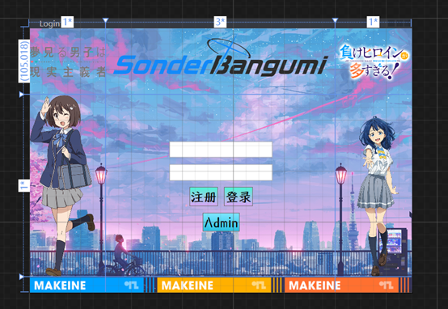
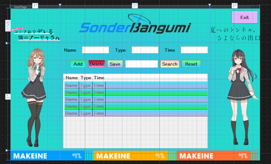
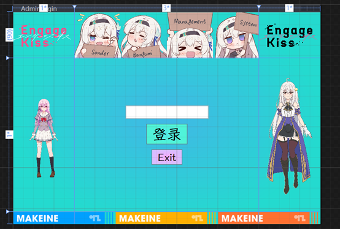
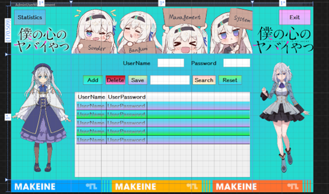
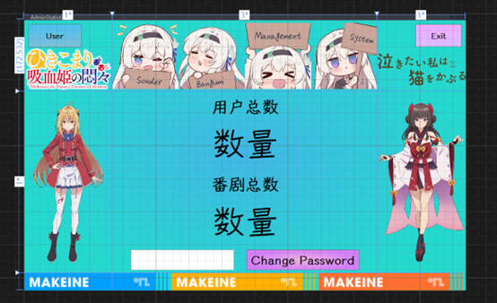
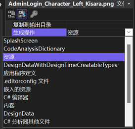

# 目录

- [1. 系统功能说明](#1-系统功能说明)
- [2. 系统设计](#2-系统设计)
- [3. 数据库结构](#3-数据库结构)

## 1. 系统功能说明

### 主要功能
- 用户功能：
  - 注册登录
  - 记录观看的番剧（包括名称、日期、类型）
  - 对番剧记录进行增删查改
- 管理员功能：
  - 管理用户账号（用户名和密码）
  - 更改自己的密码
  - 统计用户数量和番剧记录总数

### 扩展功能与特色

1. **背景音乐**: 运行时随机播放（`BackgroundMusic`文件夹）
2. **动态Logo**: `AdminLogin`等三个界面的顶部`logo`会随机切换（pic/Firefly_Logo/Random文件夹）
   
3. **自定义图标**: 
   - 使用网页生成的项目logo(BA模板)
     
   - 程序运行图标(Charlotte的logo)
     
4. **字体设置**: 程序运行时会加载`Fonts`文件夹中的字体

### 登录信息
- 用户登录
  - 用户名：`sonder`
  - 密码：`sonder`
- 管理员登录
  - 密码：`sonder`

## 2. 系统设计

### Login界面设计

界面布局：
```
+---------+-----------------+---------+
| 左上角  |    顶部logo     | 右上角  |
|  logo   | (Sonder Bangumi)|  logo   |
+---------+-----------------+---------+
| 左边    |  用户名输入框   | 右边    |
| 角色    |  密码输入框     | 角色    |
| 立绘    |  注册 | 登录按钮  | 立绘    |
|         |  Admin按钮      |         |
+---------+-----------------+---------+
|      底部logo区域         |         |
+-------------------------+---------+
```

功能说明：
1. **登录注册功能**
   - 检测用户名是否已注册
   - 验证登录信息
   - 成功登录后跳转到UserPage界面
   - 将当前登录的用户的UserId传给UserPage界面

2. **Admin功能**
   - 可跳转到AdminLogin界面

### UserPage界面设计

界面布局：
```
+--------+------------------+--------+
| logo   | 顶部logo区域     | Exit   |
|        | Sonder Bangumi   | logo   |
+--------+------------------+--------+
| 角色   | Part 1:信息显示  | 角色   |
| 立绘   | Part 2:功能按钮  | 立绘   |
|        | Part 3:数据显示  |        |
+--------+------------------+--------+
|        底部logo区域       |        |
+-----------------------------+------+
```

功能区说明：

**Part 1: 信息显示区域**
- Name、Type、Time输入框
- 支持显示选中数据
- Time格式：yyyy MM dd

**Part 2: 功能按钮区域**
- Add：添加新记录
- Delete：删除选中记录
- Save：保存修改
- Search：搜索功能
- Reset：重置显示

**Part 3: 数据显示区域**
- 交替行颜色显示
- 格式化时间显示

### AdminLogin界面设计

界面布局：
```
+---------+------------------+---------+
| 左上角  |  Sonder Bangumi  | 右上角  |
| logo    | Management System| logo    |
+---------+------------------+---------+
| 左边    |   密码输入框     | 右边    |
| 角色    |   登录按钮       | 角色    |
| 立绘    |   Exit按钮       | 立绘    |
+---------+------------------+---------+
|        底部logo区域        |         |
+----------------------------+---------+
```

### AdminUserManagement界面设计

界面布局：
```
+----------+----------------+--------+
| Statistics|  顶部logo     | Exit   |
| Logo     |  区域         | logo   |
+----------+----------------+--------+
| 角色     | Part 1:信息    | 角色   |
| 立绘     | Part 2:按钮    | 立绘   |
|          | Part 3:数据    |        |
+----------+----------------+--------+
|         底部logo区域      |        |
+----------------------------+------+
```

### AdminStatistics界面设计

界面布局：
```
+--------+------------------+--------+
| User   | Sonder Bangumi   | Exit   |
| Logo   | Management System| logo   |
+--------+------------------+--------+
| 角色   | Part 1:用户统计  | 角色   |
| 立绘   | Part 2:番剧统计  | 立绘   |
|        | Part 3:密码修改  |        |
+--------+------------------+--------+
|        底部logo区域       |        |
+----------------------------+------+
```

## 3. 数据库结构

### Admin表
| 字段名称 | 字段类型 | 字段含义 | 备注 |
|----------|----------|----------|------|
| Id | INT | 管理员id | 主键 |
| AdminPassword | NVARCHAR(50) | 管理员登录密码 | 用于管理员登录 |

### User表
| 字段名称 | 字段类型 | 字段含义 | 备注 |
|----------|----------|----------|------|
| UserId | INT | 用户id | 主键 |
| UserName | VARCHAR(20) | 用户名 | 用于登录 |
| UserPassword | VARCHAR(50) | 用户密码 | - |

### Bangumi表
| 字段名称 | 字段类型 | 字段含义 | 备注 |
|----------|----------|----------|------|
| Id | INT | 番剧id | 主键 |
| Name | VARCHAR(50) | 番剧名字 | - |
| Type | VARCHAR(50) | 番剧类型 | - |
| Time | DATETIME | 观看日期 | 格式：yyyy MM dd |
| UserId | INT | 用户Id | 由User表传入 |

## 技术参考

### 图片显示问题解决方案
- 将图片设置为资源属性
- [C#WPF，图片在显示时没有问题，但在运行时图片显示不出来的解决-腾讯云开发者社区-腾讯云](https://cloud.tencent.com/developer/article/2366069)
- 删除图片前需先取消资源属性

### SQL数据库中文支持
使用 `COLLATE Chinese_PRC_CS_AI` 设置：

参考文档 [Visual Studio中往数据库插入中文变成问号_vs数据库中文变成问号-CSDN博客](https://blog.csdn.net/weixin_42652244/article/details/105452926)

```sql
CREATE TABLE [dbo].[User] (
    [UserId]       INT          IDENTITY (500, 1) NOT NULL,
    [UserName]     VARCHAR (20) COLLATE Chinese_PRC_CS_AI NOT NULL,
    [UserPassword] VARCHAR (50) COLLATE SQL_Latin1_General_CP1_CI_AS NOT NULL,
    CONSTRAINT [PK_User] PRIMARY KEY CLUSTERED ([UserId] ASC)
);
```

### 其他技术要点
- 字体文件显示问题
  - [windows系统下，在C#程序中自动安装字体 - 一只独行的猿 - 博客园](https://www.cnblogs.com/pilgrim/p/11135273.html)
- `.NET Core` 转 `.NET Framework` 配置
  - [Visual studio将.net core 目标框架更换为.netframework_visualstudio 目标框架-CSDN博客](https://blog.csdn.net/weixin_43808473/article/details/124260862)
